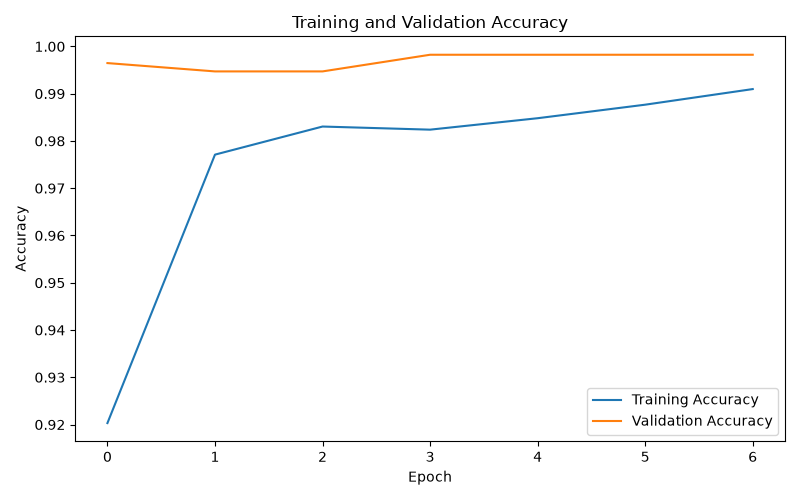
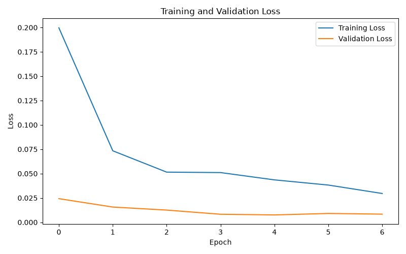

# 😷 Face Mask Detection using Deep Learning

A Deep Learning-based Face Mask Detection system that classifies images into **With Mask** and **Without Mask** categories.

This project uses **TensorFlow and Keras** to train an image classification model and **Streamlit** to provide an interactive web application where users can upload an image and receive a prediction with a confidence score.

---

## 🚀 Project Overview

Face Mask Detection is a Computer Vision and Deep Learning project designed to identify whether a person is wearing a face mask.

The system classifies images into two categories:

- 😷 **With Mask**
- 🙂 **Without Mask**

The trained Deep Learning model is integrated with a Streamlit web application for interactive image prediction.

---

## ✨ Features

- 😷 Face Mask Detection
- 🧠 Deep Learning Image Classification
- 📷 Image Upload
- 🤖 Automatic Prediction
- 📊 Confidence Score
- 📈 Training Accuracy Graph
- 📉 Training Loss Graph
- 🖥️ Streamlit Web Application
- 💾 Saved Keras Model
- 🧪 Model Testing Script

---

## 🛠️ Technologies Used

- Python
- TensorFlow
- Keras
- NumPy
- Pillow
- Streamlit
- Matplotlib
- Convolutional Neural Networks (CNN)
- Git
- GitHub

---

## 📂 Project Structure

Face-Mask-Detection/
│
├── Dataset/
│   ├── with_mask/
│   └── without_mask/
│
├── model/
│   ├── face_mask_detector.keras
│   ├── accuracy.png
│   └── loss.png
│
├── screenshots/
│   ├── home.png
│   ├── with_mask.png
│   └── without_mask.png
│
├── train.py
├── test.py
├── app.py
├── requirements.txt
├── README.md
└── .gitignore

---

## 📊 Dataset

The dataset contains two classes:

1. With Mask
2. Without Mask

Dataset structure:

Dataset/
├── with_mask/
└── without_mask/

The images are resized to **160 × 160 pixels** before being passed to the Deep Learning model.

The dataset is not included in the GitHub repository because of its size.

---

## 🧠 Deep Learning Model

The project uses a **Convolutional Neural Network (CNN)** for binary image classification.

The model performs:

1. Image loading
2. Image resizing
3. Image preprocessing
4. Feature extraction
5. Classification
6. Confidence calculation

### Input Size

160 × 160 × 3

### Output

Binary Classification

### Classes

- 😷 With Mask
- 🙂 Without Mask

The trained model is saved as:

model/face_mask_detector.keras

---

## 📈 Training Results

The model was trained using the face mask dataset.

### Training Accuracy

### Training Loss

---

## 🖥️ Streamlit Application

The project includes an interactive Streamlit application.

Users can upload an image and the application displays:

- Uploaded image
- Predicted class
- Confidence score

### 🏠 Application Screenshot

### 😷 With Mask Prediction

### 🙂 Without Mask Prediction

---

## ⚙️ Installation

### 1. Clone the Repository

git clone https://github.com/milind007K/FACE_MASK_DETECTION-main

### 2. Open the Project Folder

cd Face-Mask-Detection

### 3. Create a Virtual Environment

python -m venv venv

### 4. Activate the Virtual Environment

For Windows PowerShell:

.\venv\Scripts\Activate.ps1

### 5. Install Required Libraries

pip install -r requirements.txt

---

## ▶️ Run the Streamlit Application

Start the application using:

python -m streamlit run app.py

The application will open in your web browser.

Usually available at:

http://localhost:8501

---

## 🧪 Test the Model

Run:

python test.py

The program will ask for an image path.

Example:

Dataset\with_mask\with_mask_1.jpg

or:

Dataset\without_mask\without_mask_3.jpg

The program displays:

- Raw prediction
- Prediction
- Confidence score

---

## 🏋️ Train the Model

Make sure the dataset is organized as:

Dataset/
├── with_mask/
└── without_mask/

Run:

python train.py

After training, the model will be saved as:

model/face_mask_detector.keras

Training graphs will be saved as:

model/accuracy.png
model/loss.png

---

## 🔄 How the System Works

Input Image
     ↓
Image Preprocessing
     ↓
Resize to 160 × 160
     ↓
CNN Deep Learning Model
     ↓
Feature Extraction
     ↓
Binary Classification
     ↓
With Mask / Without Mask
     ↓
Confidence Score
     ↓
Streamlit Result

---

## 🎯 Applications

This project can be used or extended for:

- 🏥 Healthcare environments
- 🏢 Workplace safety
- 🏫 Schools and colleges
- 🚉 Public places
- 🛡️ Safety monitoring
- 📹 Smart surveillance systems
- 🚪 Access control systems

---

## 🔮 Future Improvements

- 📹 Real-time webcam detection
- 👤 Face detection before classification
- 👥 Multiple face detection
- 🎥 Real-time video processing
- 📱 Mobile application
- ☁️ Cloud deployment
- 🚀 Transfer Learning
- 📊 Improved data augmentation
- 🔔 Real-time alerts
- 🌐 Online deployment

---

## 📚 Learning Outcomes

Through this project, I gained practical experience in:

- Deep Learning
- Computer Vision
- CNN-based Image Classification
- TensorFlow
- Keras
- Image Preprocessing
- Model Training
- Model Evaluation
- Model Saving and Loading
- Streamlit
- Python
- Git
- GitHub

---

## 💻 Project Highlights

| Feature | Details |
|---|---|
| Project Type | Deep Learning |
| Domain | Computer Vision |
| Task | Image Classification |
| Classes | With Mask / Without Mask |
| Framework | TensorFlow & Keras |
| Interface | Streamlit |
| Image Size | 160 × 160 |
| Model Format | `.keras` |
| Language | Python |

---

## 👩‍💻 Author

###Milind khorgade

AI & Data Science Student

---

## ⭐ GitHub Repository

Face Mask Detection using Deep Learning

If you find this project useful, please give the repository a ⭐.

